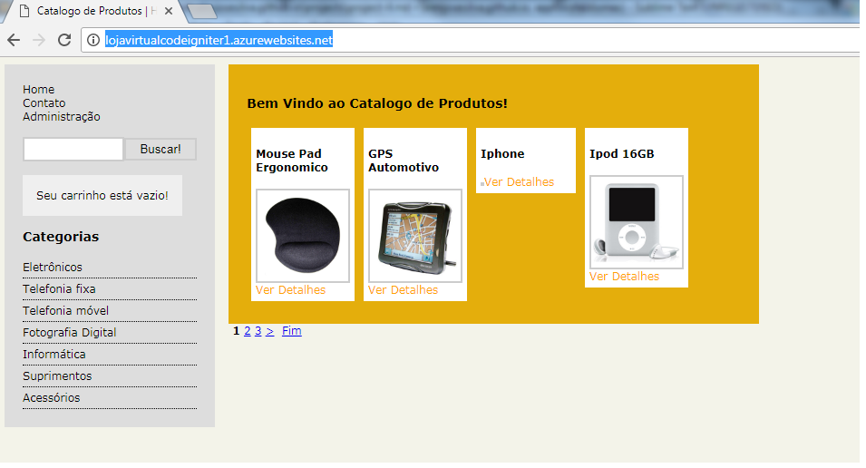
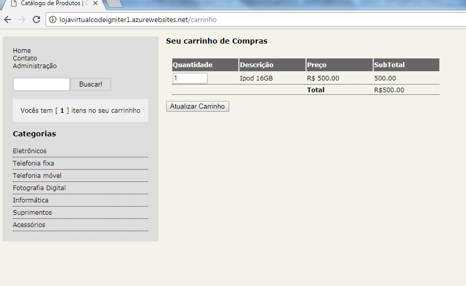
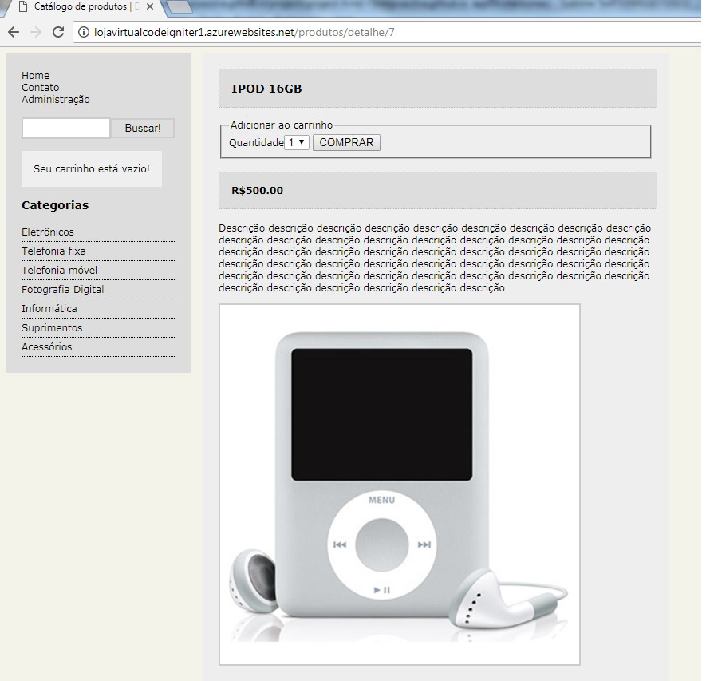

  
  
  

Projeto de Estudo Academico que envolve A linguagem de PHP 5.3 e o Framework CodeIgniter 1.7.2 com banco de dados Postgres 9.1 e o controlador de Versao gitHub. O projeto e um exercicio de como criar e manter uma loja virtual usando a linguagem php o framework codeigniter e ao mesmo tempo controlar a versao do projeto com o gitHub

Source: <a href="https://github.com/alexjosesilva/LojaVirtual">
			<i class="large github icon"></i> Loja Virtual
		 </a>
URL: <a href="http://lojavirtualcodeigniter1.azurewebsites.net/">
	<i class="large octicon-globe icon"></i> Site
</a>