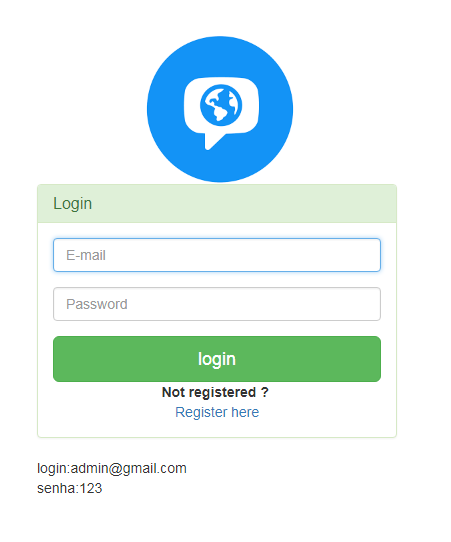

Neste projeto foi desenvolimento de um CRM com codeigniter 2.X, PHP, Mysql.
Hospedado no servidor Azure.

As funcionalidades deste CRM: monitorar alunos quanto a notas e pagamento no curso.

  
  
  

Mais sobre o app [Repositorio]

Source: <a href="https://github.com/alexjosesilva/Curso-React-Native">
	<i class="large github icon"></i> Repositorio
</a>

URL: <a href="http://sistemagestaoescolar.azurewebsites.net">
	<i class="large octicon-globe icon"></i> Site
</a>
